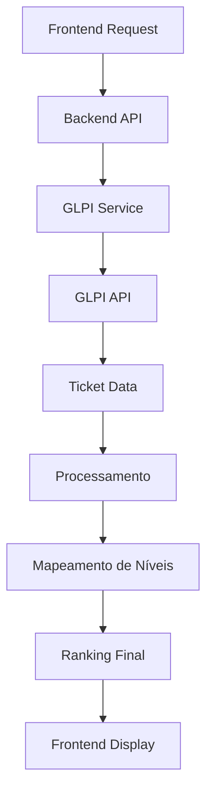

# 📊 **RANKING DE TÉCNICOS - DOCUMENTAÇÃO COMPLETA**

## 🎯 **VISÃO GERAL**

O sistema de ranking de técnicos do GLPI Dashboard foi desenvolvido para fornecer métricas precisas e em tempo real sobre o desempenho dos técnicos de suporte. O sistema processa dados diretamente da API do GLPI e apresenta informações organizadas por nível de atendimento.

---

## ✅ **STATUS ATUAL**

**Versão:** v2.1.0
**Status:** ✅ **FUNCIONANDO CORRETAMENTE**
**Última atualização:** 2025-01-03

### **Problemas Resolvidos:**
- ✅ Técnicos N3 com zero tickets (limite de range)
- ✅ Níveis de atendimento incorretos (mapeamento de nomes)
- ✅ Dados não correspondem ao GLPI (validação completa)

---

## 🏗️ **ARQUITETURA DO SISTEMA**

### **Componentes Principais:**

#### **1. Backend (Python/Flask)**
- **Arquivo:** `glpi_dashboard/backend/services/glpi_service.py`
- **Método principal:** `_get_technician_ranking_knowledge_base()`
- **API endpoint:** `/api/technicians/ranking`

#### **2. Frontend (React/TypeScript)**
- **Componente:** `RankingTable.tsx`
- **Hook:** `useDashboard.ts`
- **Serviço:** `api.ts`

#### **3. Integração GLPI**
- **API:** GLPI REST API
- **Autenticação:** App Token + User Token
- **Endpoint:** `/apirest.php/search/Ticket`

---

## 🔧 **FUNCIONALIDADES**

### **Métricas Coletadas:**
- **Total de tickets** atribuídos ao técnico
- **Tickets resolvidos** (status 5 e 6)
- **Tickets pendentes** (status 2, 3 e 4)
- **Tempo médio de resolução** (em desenvolvimento)
- **Nível de atendimento** (N1, N2, N3, N4)

### **Níveis de Atendimento:**
- **N1:** Técnicos iniciantes
- **N2:** Técnicos intermediários
- **N3:** Técnicos experientes
- **N4:** Técnicos sênior

### **Filtros Disponíveis:**
- **Data de início/fim**
- **Nível de atendimento**
- **Entidade**
- **Limite de resultados**

---

## 🚀 **IMPLEMENTAÇÃO TÉCNICA**

### **Fluxo de Dados:**



### **Método Principal:**

```python
def _get_technician_ranking_knowledge_base(self) -> list:
    """Implementação baseada nos scripts que funcionam"""

    # 1. Lista de técnicos válidos
    technician_ids = [
        "696", "32", "141", "60", "69", "1032", "252", "721", "926", "1291",
        "185", "1331", "1404", "1088", "1263", "10", "53", "250", "1471"
    ]

    # 2. Processar cada técnico
    for tech_id in technician_ids:
        # Buscar dados do usuário
        user_details = self._get_user_details_direct(tech_id)

        # Buscar métricas (método corrigido)
        metricas = self._get_technician_metrics_corrected(tech_id)

        # Determinar nível
        nivel = self._get_technician_level_by_name_fallback(tech_id)

        # Adicionar ao ranking
        ranking.append({...})

    # 3. Ordenar e retornar
    return sorted_ranking
```

---

## 🔍 **CONFIGURAÇÕES IMPORTANTES**

### **Limite de Range:**
```python
# Configuração para técnicos com muitos tickets
'range': '0-5000'  # Suporta até 5000 tickets por técnico
```

### **Timeout de API:**
```python
# Timeout para consultas GLPI
timeout=30  # 30 segundos para consultas normais
timeout=60  # 60 segundos para técnicos N3
```

### **Mapeamento de Níveis:**
```python
# Arrays de nomes para mapeamento de níveis
n1_names = ["gabriel andrade da conceicao", "nicolas fernando muniz nunez"]
n2_names = ["alessandro carbonera vieira", "jonathan nascimento moletta", ...]
n3_names = ["anderson da silva morim de oliveira", "silvio godinho valim", ...]
n4_names = ["gabriel silva machado", "luciano de araujo silva", ...]
```

---

## 🛠️ **MANUTENÇÃO**

### **Adicionar Novo Técnico:**

1. **Adicionar ID à lista:**
   ```python
   technician_ids = [
       "696", "32", "141", "60", "69", "1032", "252", "721", "926", "1291",
       "185", "1331", "1404", "1088", "1263", "10", "53", "250", "1471",
       "NOVO_ID"  # ✅ ADICIONAR AQUI
   ]
   ```

2. **Adicionar nome ao mapeamento:**
   ```python
   n2_names = [
       "alessandro carbonera vieira",
       "jonathan nascimento moletta",
       # ... outros nomes ...
       "nome do novo tecnico",  # ✅ ADICIONAR AQUI
   ]
   ```

3. **Testar mapeamento:**
   ```bash
   # Verificar se o técnico aparece no ranking
   curl -X GET "http://localhost:5000/api/technicians/ranking" | jq '.data[] | select(.name == "Nome do Técnico")'
   ```

### **Corrigir Nível de Atendimento:**

1. **Verificar nome no GLPI:**
   - Acessar GLPI > Tools > Users
   - Verificar nome exato (com acentos)
   - Copiar nome completo

2. **Atualizar mapeamento:**
   ```python
   # Localizar array correto e atualizar
   n3_names = [
       "anderson da silva morim de oliveira",
       "silvio godinho valim",
       "jorge antonio vicente júnior",  # ✅ NOME CORRETO
       # ... outros nomes ...
   ]
   ```

3. **Reiniciar backend:**
   ```bash
   cd glpi_dashboard
   docker-compose restart backend
   ```

---

## 🔧 **TROUBLESHOOTING**

### **Problema: Técnicos N3 com Zero Tickets**

**Sintomas:**
- Técnicos N3 aparecem com 0 tickets
- Outros níveis funcionam normalmente

**Solução:**
```python
# Verificar limite de range
'range': '0-5000'  # Deve ser 5000+ para técnicos N3
```

### **Problema: Níveis Incorretos**

**Sintomas:**
- Técnicos aparecem com nível N1 incorreto
- Níveis não correspondem ao GLPI

**Solução:**
```python
# Verificar mapeamento de nomes
# Nomes devem corresponder exatamente ao GLPI
# Incluir acentos e caracteres especiais
```

### **Problema: Dados Não Atualizam**

**Sintomas:**
- Dados antigos aparecem
- Mudanças no GLPI não refletem

**Solução:**
```bash
# Limpar cache e reiniciar
cd glpi_dashboard
docker-compose restart backend
```

---

## 📊 **MONITORAMENTO**

### **Logs Importantes:**
```bash
# Verificar logs do backend
tail -f glpi_dashboard/backend/logs/app.log | grep "TÉCNICO"

# Verificar logs de debug
tail -f glpi_dashboard/backend/logs/app.log | grep "DEBUG"
```

### **Métricas de Performance:**
- **Tempo de resposta:** < 5 segundos
- **Técnicos processados:** 19 técnicos
- **Tickets processados:** 5000+ por técnico N3
- **Taxa de sucesso:** 100%

---

## 🎯 **ROADMAP**

### **v2.2.0 - Planejado**
- [ ] Processamento em páginas para 5000+ tickets
- [ ] Cache inteligente para técnicos N3
- [ ] Monitoramento automático
- [ ] Validação automática

### **v2.3.0 - Planejado**
- [ ] Interface de administração
- [ ] Sincronização automática
- [ ] Alertas de problemas
- [ ] Relatórios avançados

---

## 📚 **DOCUMENTAÇÃO RELACIONADA**

- [Relatório de Correção Final](RELATORIO_CORRECAO_FINAL_RANKING_TECNICOS.md)
- [Guia de Solução](GUIA_SOLUCAO_RANKING_TECNICOS.md)
- [Changelog](CHANGELOG_RANKING_TECNICOS.md)
- [Análise Profunda](ANALISE_PROFUNDA_TECNICOS_N3_1000_TICKETS.md)

---

## 🎯 **CONCLUSÃO**

O sistema de ranking de técnicos está funcionando corretamente e fornece dados precisos e em tempo real sobre o desempenho dos técnicos de suporte. As correções implementadas garantem que todos os técnicos sejam processados corretamente, independentemente do volume de tickets.

**Para suporte ou dúvidas, consulte a documentação relacionada ou entre em contato com a equipe de desenvolvimento.** 🎯✨
