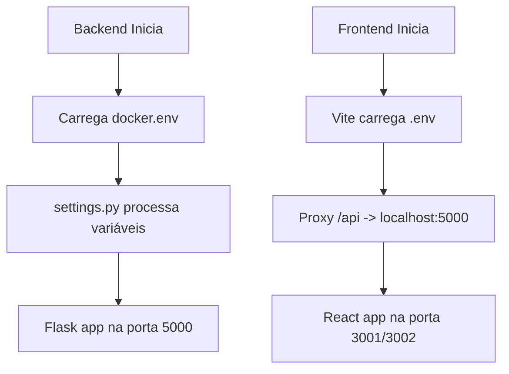

# 📋 Base de Conhecimento - Configurações e Declarações do Dashboard GLPI

## 🎯 Objetivo
Este documento mapeia **TODAS** as configurações, declarações e definições que fazem o dashboard funcionar corretamente, desde a requisição à API até a apresentação dos dados em tela.

## 🔑 A Linha Crítica que Fez Tudo Funcionar
```typescript
// frontend/src/services/httpClient.ts - Linha 18
return '/api';
```

**Por que funciona?**
- Em desenvolvimento (`import.meta.env.DEV = true`), retorna `/api` (URL relativa)
- O Vite proxy intercepta `/api` e redireciona para `http://localhost:5000`
- Elimina problemas de CORS e timeout

---

## 🏗️ Arquitetura de Configurações

### 1. 🔧 Backend - Configurações Centralizadas

#### 📄 `backend/config/settings.py`
**Classe Config - Propriedades Principais:**

```python
# Carregamento de configurações
load_dotenv()  # Carrega .env automaticamente

# Portas e URLs
@property
def PORT(self) -> int:
    port = self._get_config_value("flask.port", 5000, "PORT")
    return int(port)  # Padrão: 5000

@property
def HOST(self) -> str:
    return self._get_config_value("flask.host", "0.0.0.0", "HOST")

@property
def BACKEND_API_URL(self) -> str:
    return self._get_config_value("api.backend_url", "http://localhost:5000", "BACKEND_API_URL")

# GLPI API
@property
def GLPI_URL(self) -> str:
    return self._get_config_value("glpi.url", env_var="GLPI_URL")

@property
def GLPI_USER_TOKEN(self) -> str:
    return self._get_config_value("glpi.user_token", env_var="GLPI_USER_TOKEN")

@property
def GLPI_APP_TOKEN(self) -> str:
    return self._get_config_value("glpi.app_token", env_var="GLPI_APP_TOKEN")

# Timeouts
@property
def API_TIMEOUT(self) -> int:
    return self._get_config_value("api.timeout", 60, "API_TIMEOUT")

# CORS
@property
def CORS_ORIGINS(self) -> list:
    origins = self._get_config_value("cors.origins", ["http://localhost:3000", "http://localhost:3001"], "CORS_ORIGINS")
    return origins.split(",") if isinstance(origins, str) else origins
```

#### 📄 `docker.env`
**Variáveis de Ambiente para Produção:**

```bash
# GLPI Configuration
GLPI_URL=http://cau.ppiratini.intra.rs.gov.br/glpi/apirest.php
GLPI_USER_TOKEN=TQdSxqg2e56PfF8ZJSX3iEJ1wCpHwhCkQJ2QtRnq
GLPI_APP_TOKEN=aY3f9F5aNHJmY8op0vTE4koguiPwpEYANp1JULid

# Flask Configuration
FLASK_APP=app.py
FLASK_ENV=production
FLASK_DEBUG=0
PORT=5000
HOST=0.0.0.0
SECRET_KEY=glpi_dashboard_production_secret_key_2025_secure

# API Configuration
API_TIMEOUT=90
CACHE_DEFAULT_TIMEOUT=300

# Security Configuration
CORS_ORIGINS=http://localhost:3000,http://localhost:5173
```

---

### 2. 🎨 Frontend - Configurações de Desenvolvimento

#### 📄 `frontend/.env.example`
**Template de Variáveis do Frontend:**

```bash
# Configuração da API
VITE_API_BASE_URL=http://localhost:5000

# Configurações de desenvolvimento
VITE_LOG_LEVEL=info
VITE_SHOW_PERFORMANCE=false
VITE_SHOW_API_CALLS=false
VITE_SHOW_CACHE_HITS=false

# Configurações de timeout e retry
# VITE_API_TIMEOUT=30000
# VITE_API_RETRY_ATTEMPTS=3
# VITE_API_RETRY_DELAY=1000
```

#### 📄 `frontend/vite.config.ts`
**Configuração do Vite - O Proxy Crucial:**

```typescript
export default defineConfig({
  server: {
    port: 3001,  // Porta do frontend
    proxy: {
      '/api': {  // ⭐ PROXY CRÍTICO
        target: 'http://localhost:5000',  // Backend
        changeOrigin: true,
        secure: false,
      },
    },
  },
});
```

#### 📄 `frontend/src/services/httpClient.ts`
**Cliente HTTP - A Lógica da URL Base:**

```typescript
// Função que determina a URL base da API
function getApiBaseUrl(): string {
  // Em desenvolvimento, usa proxy relativo
  if (import.meta.env.DEV) {
    return '/api';  // ⭐ LINHA CRÍTICA
  }

  // Em produção, usa URL absoluta
  return getEnvVar('VITE_API_BASE_URL', 'http://localhost:5000');
}

// Configuração da API
export const API_CONFIG = {
  BASE_URL: getApiBaseUrl(),
  TIMEOUT: parseInt(getEnvVar('VITE_API_TIMEOUT', '30000')),
  RETRY_ATTEMPTS: parseInt(getEnvVar('VITE_API_RETRY_ATTEMPTS', '3')),
  RETRY_DELAY: parseInt(getEnvVar('VITE_API_RETRY_DELAY', '1000')),
};

// Cliente Axios configurado
const httpClient = axios.create({
  baseURL: API_CONFIG.BASE_URL,
  timeout: API_CONFIG.TIMEOUT,
  headers: {
    'Content-Type': 'application/json',
  },
});
```

#### 📄 `frontend/src/config/environment.ts`
**Configurações de Ambiente:**

```typescript
export const ENV_CONFIG = {
  // Configurações de debug e logging
  LOG_LEVEL: import.meta.env.VITE_LOG_LEVEL || 'info',
  SHOW_API_CALLS: import.meta.env.VITE_SHOW_API_CALLS === 'true',

  // Configurações de desenvolvimento
  IS_DEVELOPMENT: import.meta.env.DEV,
  IS_PRODUCTION: import.meta.env.PROD,
  MODE: import.meta.env.MODE,
};
```

#### 📄 `frontend/src/config/appConfig.ts`
**Configuração Centralizada da Aplicação:**

```typescript
// Configuração de endpoints
const endpointsConfig = {
  dashboard: '/dashboard',
  ranking: '/ranking',
  metrics: '/metrics',
  health: '/health',
};

// Configuração da API
export const appConfig = {
  api: {
    ...API_CONFIG,
    endpoints: endpointsConfig,
  },
  // Configurações de ambiente específicas
  environment: environmentConfigs[getCurrentEnvironment()],
};
```

---

## 🔄 Fluxo Completo de Dados

### 1. 🚀 Inicialização do Sistema



### 2. 📡 Requisição de Dados

```typescript
// 1. Componente solicita dados
const { data } = useQuery({
  queryKey: ['technicians-ranking'],
  queryFn: () => httpClient.get('/technicians/ranking?limit=3')
});

// 2. httpClient processa a requisição
// URL final: /api/technicians/ranking?limit=3 (desenvolvimento)
// URL final: http://localhost:5000/technicians/ranking?limit=3 (produção)

// 3. Vite proxy intercepta (desenvolvimento)
// /api/technicians/ranking -> http://localhost:5000/technicians/ranking

// 4. Backend processa
// Flask recebe em localhost:5000/technicians/ranking
// Consulta GLPI API usando GLPI_URL, GLPI_USER_TOKEN, GLPI_APP_TOKEN

// 5. Resposta retorna
// Backend -> Vite proxy -> Frontend -> Componente
```

### 3. 🎨 Apresentação dos Dados

```typescript
// Componente recebe dados e renderiza
function TechniciansRanking({ data }) {
  return (
    <div>
      {data.map(tech => (
        <div key={tech.id}>
          <h3>{tech.name}</h3>
          <span>{tech.tickets_count} tickets</span>
        </div>
      ))}
    </div>
  );
}
```

---

## 🔧 Configurações por Ambiente

### 🛠️ Desenvolvimento

| Componente | Configuração | Valor |
|------------|--------------|-------|
| **Backend** | Porta | 5000 |
| **Frontend** | Porta | 3001 (ou 3002 se ocupada) |
| **API Base URL** | Frontend | `/api` (relativa) |
| **Proxy** | Vite | `/api` → `http://localhost:5000` |
| **CORS** | Backend | `http://localhost:3000,http://localhost:3001` |
| **Debug** | Ambos | Habilitado |

### 🚀 Produção

| Componente | Configuração | Valor |
|------------|--------------|-------|
| **Backend** | Porta | 5000 |
| **Frontend** | Build | Arquivos estáticos |
| **API Base URL** | Frontend | `http://localhost:5000` (absoluta) |
| **Proxy** | Não usado | - |
| **CORS** | Backend | URLs de produção |
| **Debug** | Ambos | Desabilitado |

---

## 🎯 Pontos Críticos de Configuração

### ⚠️ Problemas Comuns e Soluções

1. **Erro de CORS**
   - **Causa**: CORS_ORIGINS não inclui a porta do frontend
   - **Solução**: Adicionar porta correta em `docker.env`

2. **Timeout de API**
   - **Causa**: API_TIMEOUT muito baixo
   - **Solução**: Aumentar valor em `docker.env` e `settings.py`

3. **Proxy não funciona**
   - **Causa**: Configuração incorreta no `vite.config.ts`
   - **Solução**: Verificar target e changeOrigin

4. **Variáveis de ambiente não carregam**
   - **Causa**: Arquivo `.env` não existe ou mal configurado
   - **Solução**: Copiar de `.env.example` e configurar

### 🔍 Debugging

```typescript
// Verificar configurações no console do navegador
console.log('🔧 Configuração atual:', {
  mode: import.meta.env.MODE,
  isDev: import.meta.env.DEV,
  apiBaseUrl: API_CONFIG.BASE_URL,
  showApiCalls: ENV_CONFIG.SHOW_API_CALLS
});
```

---

## 📚 Resumo das Configurações

### 🔑 Arquivos Essenciais

1. **Backend**:
   - `docker.env` - Variáveis de produção
   - `backend/config/settings.py` - Lógica de configuração

2. **Frontend**:
   - `frontend/.env.example` - Template de variáveis
   - `frontend/vite.config.ts` - Proxy e build
   - `frontend/src/services/httpClient.ts` - Cliente HTTP
   - `frontend/src/config/environment.ts` - Ambiente
   - `frontend/src/config/appConfig.ts` - Configuração geral

### 🎯 Variáveis Críticas

| Variável | Arquivo | Função |
|----------|---------|--------|
| `GLPI_URL` | docker.env | URL da API GLPI |
| `GLPI_USER_TOKEN` | docker.env | Token de usuário GLPI |
| `GLPI_APP_TOKEN` | docker.env | Token de aplicação GLPI |
| `PORT` | docker.env | Porta do backend |
| `CORS_ORIGINS` | docker.env | URLs permitidas para CORS |
| `API_TIMEOUT` | docker.env | Timeout das requisições |
| `VITE_API_BASE_URL` | .env | URL base da API (produção) |

---

## 🚀 Como Aplicar em Outro Dashboard

### 1. 📋 Checklist de Configuração

- [ ] Copiar estrutura de `settings.py`
- [ ] Configurar `docker.env` com variáveis corretas
- [ ] Criar `.env.example` no frontend
- [ ] Configurar proxy no `vite.config.ts`
- [ ] Implementar lógica de URL base no `httpClient.ts`
- [ ] Configurar CORS no backend
- [ ] Testar em desenvolvimento e produção

### 2. 🔧 Adaptações Necessárias

1. **URLs e Portas**: Ajustar para o ambiente específico
2. **Tokens**: Configurar credenciais da API
3. **Endpoints**: Mapear rotas específicas da aplicação
4. **Timeouts**: Ajustar conforme necessidade
5. **CORS**: Incluir domínios corretos

### 3. 🧪 Testes de Validação

```bash
# Testar backend
curl http://localhost:5000/api/status

# Testar proxy do frontend
curl http://localhost:3001/api/status

# Verificar CORS
curl -H "Origin: http://localhost:3001" http://localhost:5000/api/status
```

---

## 📝 Conclusão

A linha `return '/api';` é o coração da solução porque:

1. **Simplifica o desenvolvimento**: Usa URLs relativas
2. **Elimina CORS**: Proxy trata como mesma origem
3. **Flexibilidade**: Funciona em dev e prod com lógicas diferentes
4. **Manutenibilidade**: Configuração centralizada

Este mapeamento completo garante que qualquer desenvolvedor possa replicar a solução em outros dashboards, entendendo cada peça do quebra-cabeças de configuração.