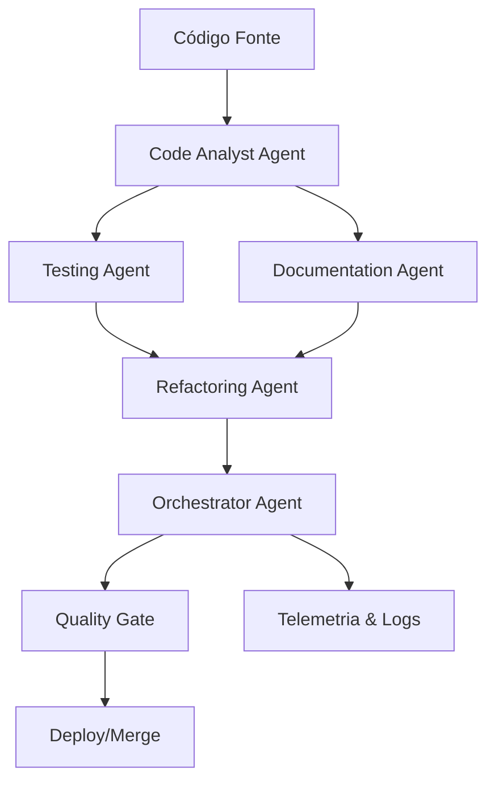

# Análise Completa dos Modelos NVIDIA para Integração Multi-Agente

## Resumo Executivo

Esta análise avalia os modelos NVIDIA mais recentes para implementação de uma arquitetura multi-agente no projeto GLPI Dashboard, focando em qualidade de desenvolvimento, consistência e tecnologias open-source.

## 1. NVIDIA NeMo Agent Toolkit

### Características Principais
- **Propósito**: Biblioteca open-source para conectar, avaliar e acelerar equipes de agentes AI
- **Compatibilidade**: Suporta frameworks como LangChain, CrewAI, e outros
- **Recursos**:
  - Telemetria e observabilidade de agentes
  - Orquestração de múltiplos agentes
  - Suporte ao Model Context Protocol (MCP)
  - Sistema de avaliação integrado
  - Desenvolvimento rápido e reutilização

### Vantagens para o Projeto
- ✅ **Open-source** e gratuito
- ✅ **Orquestração nativa** de múltiplos agentes
- ✅ **Observabilidade** completa do sistema
- ✅ **Integração** com frameworks populares
- ✅ **Telemetria** para monitoramento de performance

### Casos de Uso no GLPI Dashboard
- Coordenação entre agentes de análise de código
- Monitoramento de qualidade em tempo real
- Orquestração de tarefas de desenvolvimento
- Avaliação contínua de performance dos agentes

## 2. NVIDIA Nemotron-Nano-9B-v2

### Especificações Técnicas
- **Arquitetura**: Híbrida Mamba2-Transformer
- **Parâmetros**: 9 bilhões
- **Contexto**: Até 128K tokens
- **Precisão**: bfloat16 nativo
- **Linguagens**: Inglês, Alemão, Espanhol, Francês, Italiano, Japonês, Coreano, Português, Russo, Chinês

### Capacidades Avançadas
- **Reasoning On/Off**: Controle de raciocínio em tempo de execução
- **Thinking Budget**: Controle de tokens para raciocínio
- **Performance**: Até 6x mais rápido que modelos comparáveis
- **Eficiência**: Otimizado para edge computing e inferência local

### Benchmarks de Performance
- **AIME25**: 72.1% (vs Qwen3-8B: 69.3%)
- **MATH500**: 97.8% (vs Qwen3-8B: 96.3%)
- **GPQA**: 64.0% (vs Qwen3-8B: 59.6%)
- **LiveCodeBench**: 71.1% (vs Qwen3-8B: 59.5%)
- **IFEval**: 90.3% (vs Qwen3-8B: 89.4%)

### Vantagens para Desenvolvimento
- ✅ **Raciocínio transparente** com traces de pensamento
- ✅ **Geração de código** com explicações passo-a-passo
- ✅ **Eficiência energética** para uso contínuo
- ✅ **Controle granular** de recursos computacionais
- ✅ **Suporte multilíngue** incluindo português

## 3. Catálogo NVIDIA Build Platform

### Modelos Destacados para o Projeto

#### 3.1 Llama Nemotron (Família de Reasoning)
- **Nano**: Otimizado para PCs e edge devices
- **Super**: Melhor precisão em GPU única
- **Ultra**: Máxima precisão em servidores multi-GPU
- **Melhoria**: Até 20% mais preciso que modelos base
- **Performance**: 5x mais rápido que outros modelos de reasoning

#### 3.2 OpenAI gpt-oss (20B e 120B)
- **Otimização**: Específica para arquitetura NVIDIA Blackwell
- **Performance**: Até 1.5M tokens/segundo em GB200 NVL72
- **Disponibilidade**: Via NVIDIA NIM microservices

#### 3.3 NVIDIA Cosmos (Physical AI)
- **Propósito**: Modelos de fundação para AI física
- **Capacidades**: Simulação avançada e predição de cenários
- **Aplicação**: Robótica e veículos autônomos
- **Licença**: Open-source no GitHub

### 4. Ferramentas e Plataformas Complementares

#### 4.1 NVIDIA NIM Microservices
- **Função**: Inferência otimizada para modelos
- **Benefícios**: Deploy rápido e escalável
- **Segurança**: Nível empresarial
- **Compatibilidade**: Qualquer infraestrutura GPU

#### 4.2 NVIDIA AI Blueprints
- **Propósito**: Workflows pré-configurados para agentes
- **Exemplos**: PDF-to-podcast, análise de vídeo
- **Integração**: CrewAI, LangChain, LlamaIndex

#### 4.3 NVIDIA NeMo Framework
- **Função**: Customização e treinamento de modelos
- **Recursos**: End-to-end para desenvolvimento AI
- **Suporte**: Lifecycle completo de agentes AI

## 5. Comparação com Modelos Anteriormente Considerados

### Vantagens dos Modelos NVIDIA vs. Modelos Tradicionais

| Aspecto | Modelos NVIDIA 2025 | Modelos Anteriores |
|---------|-------------------|------------------|
| **Reasoning** | Controle on/off nativo | Limitado ou inexistente |
| **Performance** | 5-6x mais rápido | Performance padrão |
| **Orquestração** | NeMo Agent Toolkit | Soluções customizadas |
| **Observabilidade** | Telemetria integrada | Monitoramento manual |
| **Eficiência** | Arquitetura híbrida | Transformers puros |
| **Multilíngue** | Suporte nativo | Limitado |
| **Edge Computing** | Otimizado | Requer recursos altos |

## 6. Arquitetura Multi-Agente Proposta

### 6.1 Agentes Especializados

#### Agente de Análise de Código (Code Analyst Agent)
- **Modelo**: Nemotron-Nano-9B-v2 com reasoning ON
- **Função**: Análise estática e dinâmica de código
- **Capacidades**: Detecção de bugs, sugestões de melhoria, padrões de segurança

#### Agente de Documentação (Documentation Agent)
- **Modelo**: Llama Nemotron Super
- **Função**: Geração automática de documentação
- **Capacidades**: README, comentários, diagramas de arquitetura

#### Agente de Testes (Testing Agent)
- **Modelo**: Nemotron-Nano-9B-v2 com thinking budget controlado
- **Função**: Geração e execução de testes
- **Capacidades**: Unit tests, integration tests, test coverage

#### Agente de Refatoração (Refactoring Agent)
- **Modelo**: gpt-oss-20b via NIM
- **Função**: Otimização e refatoração de código
- **Capacidades**: Performance, legibilidade, padrões de design

#### Agente Orquestrador (Orchestrator Agent)
- **Framework**: NeMo Agent Toolkit
- **Função**: Coordenação e supervisão
- **Capacidades**: Workflow management, conflict resolution, quality assurance

### 6.2 Fluxo de Trabalho Integrado

## 7. Requisitos de Hardware e Compatibilidade

### 7.1 NVIDIA RTX A4000 16GB - Análise de Compatibilidade

#### Modelos Suportados
- ✅ **Nemotron-Nano-9B-v2**: Perfeito (9B parâmetros, ~18GB em fp16, ~9GB em int8)
- ✅ **Llama Nemotron Nano**: Otimizado para single GPU
- ⚠️ **gpt-oss-20b**: Possível com quantização
- ❌ **gpt-oss-120b**: Requer múltiplas GPUs

#### Otimizações Recomendadas
- **Quantização**: INT8/INT4 para modelos maiores
- **Model Sharding**: Para modelos que excedem VRAM
- **Gradient Checkpointing**: Para treinamento/fine-tuning
- **Mixed Precision**: bfloat16 para eficiência

### 7.2 Configuração de Cache Otimizada
- **Drive B:**: 1.8TB disponível para cache de modelos
- **Configuração**: Já implementada com variáveis de ambiente
- **Performance**: SSD para cache ativo, HDD para armazenamento

## 8. Roadmap de Implementação

### Fase 1: Infraestrutura Base (Semanas 1-2)
- [ ] Instalação do NeMo Agent Toolkit
- [ ] Configuração dos NIM microservices
- [ ] Setup do ambiente de desenvolvimento
- [ ] Testes de compatibilidade com RTX A4000

### Fase 2: Agentes Individuais (Semanas 3-6)
- [ ] Implementação do Code Analyst Agent
- [ ] Desenvolvimento do Testing Agent
- [ ] Criação do Documentation Agent
- [ ] Setup do Refactoring Agent

### Fase 3: Orquestração (Semanas 7-8)
- [ ] Integração com NeMo Agent Toolkit
- [ ] Implementação do Orchestrator Agent
- [ ] Configuração de telemetria e logs
- [ ] Testes de integração

### Fase 4: Otimização e Deploy (Semanas 9-10)
- [ ] Fine-tuning dos modelos
- [ ] Otimização de performance
- [ ] Implementação de CI/CD
- [ ] Documentação completa

## 9. Estimativa de Recursos

### 9.1 Recursos Computacionais
- **GPU**: NVIDIA RTX A4000 16GB (suficiente)
- **RAM**: 32GB recomendado (atual: verificar)
- **Storage**: 100GB para modelos + cache (disponível)
- **CPU**: Multi-core para orquestração (atual: verificar)

### 9.2 Recursos de Desenvolvimento
- **Tempo**: 10 semanas para implementação completa
- **Complexidade**: Alta (arquitetura multi-agente)
- **Manutenção**: Média (ferramentas NVIDIA)
- **Escalabilidade**: Alta (NIM microservices)

## 10. Conclusões e Recomendações

### 10.1 Modelos Recomendados
1. **Principal**: NVIDIA Nemotron-Nano-9B-v2
   - Melhor custo-benefício
   - Reasoning controlável
   - Otimizado para hardware disponível

2. **Complementar**: Llama Nemotron Nano
   - Para tarefas específicas
   - Maior precisão quando necessário

3. **Orquestração**: NeMo Agent Toolkit
   - Solução completa e open-source
   - Observabilidade integrada

### 10.2 Vantagens da Solução Proposta
- **5x mais capacidade** através de múltiplos agentes especializados
- **Qualidade superior** com reasoning transparente
- **Consistência** através de orquestração centralizada
- **Escalabilidade** com NIM microservices
- **Observabilidade** completa do sistema
- **Custo zero** (tecnologias open-source)

### 10.3 Próximos Passos Imediatos
1. Validar recursos de hardware disponíveis
2. Instalar e configurar NeMo Agent Toolkit
3. Implementar primeiro agente (Code Analyst)
4. Estabelecer pipeline de telemetria
5. Documentar processo para replicação

---

**Data da Análise**: Janeiro 2025  
**Versão**: 1.0  
**Status**: Pronto para implementação