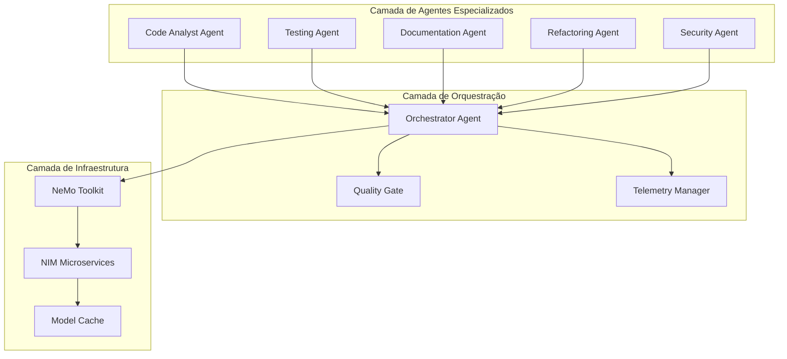
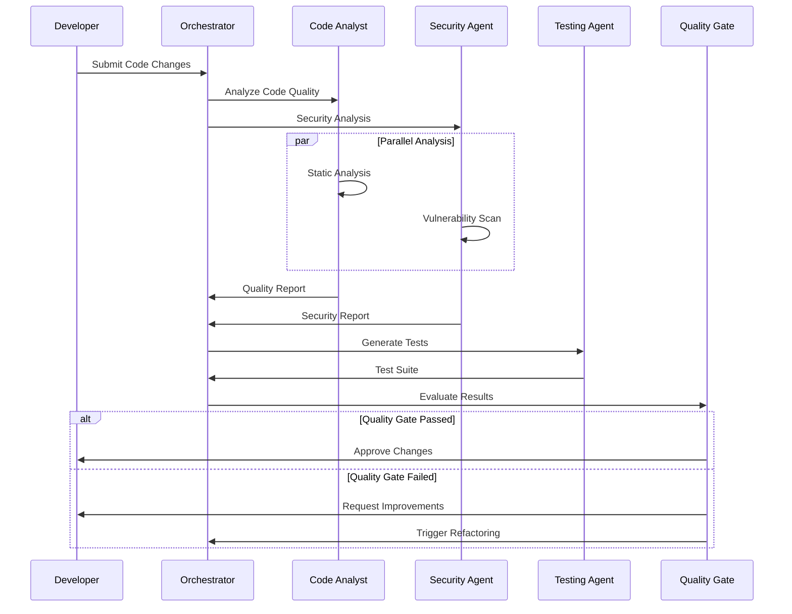
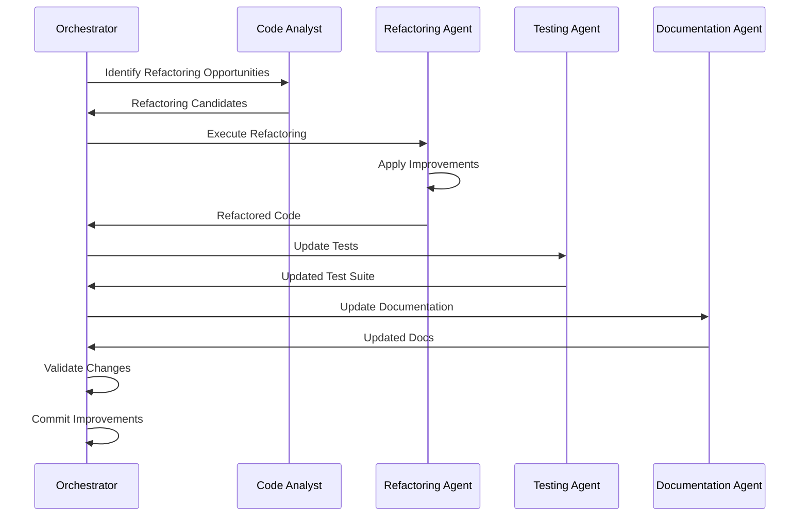

# Arquitetura Multi-Agente para GLPI Dashboard

## Visão Geral da Arquitetura

Esta arquitetura implementa um sistema de múltiplos agentes AI especializados que trabalham colaborativamente para melhorar a qualidade, consistência e eficiência do desenvolvimento do GLPI Dashboard.

## 1. Componentes Principais

### 1.1 Agentes Especializados



### 1.2 Especificações dos Agentes

#### Code Analyst Agent
```yaml
Nome: CodeAnalystAgent
Modelo: NVIDIA Nemotron-Nano-9B-v2
Configuração:
  reasoning: ON
  thinking_budget: 1000 tokens
  temperature: 0.1
  max_tokens: 4096

Responsabilidades:
  - Análise estática de código
  - Detecção de code smells
  - Identificação de vulnerabilidades
  - Sugestões de otimização
  - Validação de padrões de design

Entradas:
  - Arquivos de código fonte
  - Diff de mudanças
  - Contexto do projeto

Saídas:
  - Relatório de análise
  - Sugestões de melhoria
  - Score de qualidade
  - Recomendações de refatoração
```

#### Testing Agent
```yaml
Nome: TestingAgent
Modelo: NVIDIA Nemotron-Nano-9B-v2
Configuração:
  reasoning: ON
  thinking_budget: 800 tokens
  temperature: 0.2
  max_tokens: 3072

Responsabilidades:
  - Geração de testes unitários
  - Criação de testes de integração
  - Análise de cobertura
  - Validação de casos edge
  - Testes de performance

Entradas:
  - Código fonte
  - Especificações funcionais
  - Casos de uso

Saídas:
  - Suítes de teste
  - Relatórios de cobertura
  - Casos de teste edge
  - Métricas de qualidade
```

#### Documentation Agent
```yaml
Nome: DocumentationAgent
Modelo: Llama Nemotron Super (quando disponível) ou Nemotron-Nano-9B-v2
Configuração:
  reasoning: OFF (para velocidade)
  temperature: 0.3
  max_tokens: 8192

Responsabilidades:
  - Geração de documentação técnica
  - Criação de README files
  - Documentação de APIs
  - Diagramas de arquitetura
  - Comentários de código

Entradas:
  - Código fonte
  - Especificações
  - Arquitetura do sistema

Saídas:
  - Documentação markdown
  - Diagramas mermaid
  - Comentários inline
  - Guias de uso
```

#### Refactoring Agent
```yaml
Nome: RefactoringAgent
Modelo: NVIDIA Nemotron-Nano-9B-v2
Configuração:
  reasoning: ON
  thinking_budget: 1200 tokens
  temperature: 0.1
  max_tokens: 6144

Responsabilidades:
  - Refatoração de código
  - Otimização de performance
  - Aplicação de design patterns
  - Melhoria de legibilidade
  - Redução de complexidade

Entradas:
  - Código a ser refatorado
  - Métricas de qualidade
  - Requisitos de performance

Saídas:
  - Código refatorado
  - Explicação das mudanças
  - Métricas de melhoria
  - Plano de migração
```

#### Security Agent
```yaml
Nome: SecurityAgent
Modelo: NVIDIA Nemotron-Nano-9B-v2
Configuração:
  reasoning: ON
  thinking_budget: 1000 tokens
  temperature: 0.05
  max_tokens: 4096

Responsabilidades:
  - Análise de vulnerabilidades
  - Validação de práticas seguras
  - Auditoria de dependências
  - Verificação de autenticação
  - Análise de exposição de dados

Entradas:
  - Código fonte
  - Configurações
  - Dependências

Saídas:
  - Relatório de segurança
  - Vulnerabilidades encontradas
  - Recomendações de correção
  - Score de segurança
```

#### Orchestrator Agent
```yaml
Nome: OrchestratorAgent
Framework: NVIDIA NeMo Agent Toolkit
Modelo: Nemotron-Nano-9B-v2 (para decisões)
Configuração:
  reasoning: ON
  thinking_budget: 500 tokens
  temperature: 0.2

Responsabilidades:
  - Coordenação de agentes
  - Resolução de conflitos
  - Priorização de tarefas
  - Quality gate management
  - Telemetria e monitoramento

Entradas:
  - Resultados dos agentes
  - Contexto do projeto
  - Políticas de qualidade

Saídas:
  - Decisões de workflow
  - Relatórios consolidados
  - Métricas de sistema
  - Ações de correção
```

## 2. Fluxos de Trabalho

### 2.1 Fluxo de Análise de Código



### 2.2 Fluxo de Refatoração Automática



## 3. Interfaces e APIs

### 3.1 Interface Base do Agente

```python
from abc import ABC, abstractmethod
from typing import Dict, Any, List
from dataclasses import dataclass
from enum import Enum

class AgentStatus(Enum):
    IDLE = "idle"
    PROCESSING = "processing"
    COMPLETED = "completed"
    ERROR = "error"

@dataclass
class AgentResult:
    agent_id: str
    status: AgentStatus
    output: Dict[str, Any]
    confidence: float
    processing_time: float
    tokens_used: int
    reasoning_trace: List[str] = None

class BaseAgent(ABC):
    def __init__(self, agent_id: str, model_config: Dict[str, Any]):
        self.agent_id = agent_id
        self.model_config = model_config
        self.status = AgentStatus.IDLE
        self.telemetry = []
    
    @abstractmethod
    async def process(self, input_data: Dict[str, Any]) -> AgentResult:
        """Processa entrada e retorna resultado"""
        pass
    
    @abstractmethod
    def validate_input(self, input_data: Dict[str, Any]) -> bool:
        """Valida dados de entrada"""
        pass
    
    def get_telemetry(self) -> List[Dict[str, Any]]:
        """Retorna dados de telemetria"""
        return self.telemetry
```

### 3.2 Implementação do Code Analyst Agent

```python
import ast
import re
from typing import Dict, Any, List
from pathlib import Path

class CodeAnalystAgent(BaseAgent):
    def __init__(self):
        super().__init__(
            agent_id="code_analyst",
            model_config={
                "model": "nvidia/nemotron-nano-9b-v2",
                "reasoning": True,
                "thinking_budget": 1000,
                "temperature": 0.1,
                "max_tokens": 4096
            }
        )
        self.quality_metrics = {
            "complexity": 0,
            "maintainability": 0,
            "security": 0,
            "performance": 0,
            "documentation": 0
        }
    
    async def process(self, input_data: Dict[str, Any]) -> AgentResult:
        """Analisa código e retorna relatório de qualidade"""
        start_time = time.time()
        
        try:
            self.status = AgentStatus.PROCESSING
            
            code_content = input_data.get("code", "")
            file_path = input_data.get("file_path", "")
            context = input_data.get("context", {})
            
            # Análise estática
            static_analysis = await self._static_analysis(code_content)
            
            # Análise com modelo AI
            ai_analysis = await self._ai_analysis(code_content, context)
            
            # Cálculo de métricas
            metrics = self._calculate_metrics(static_analysis, ai_analysis)
            
            # Geração de sugestões
            suggestions = await self._generate_suggestions(code_content, metrics)
            
            result = AgentResult(
                agent_id=self.agent_id,
                status=AgentStatus.COMPLETED,
                output={
                    "metrics": metrics,
                    "suggestions": suggestions,
                    "static_analysis": static_analysis,
                    "ai_analysis": ai_analysis,
                    "overall_score": self._calculate_overall_score(metrics)
                },
                confidence=ai_analysis.get("confidence", 0.8),
                processing_time=time.time() - start_time,
                tokens_used=ai_analysis.get("tokens_used", 0),
                reasoning_trace=ai_analysis.get("reasoning_trace", [])
            )
            
            self.status = AgentStatus.COMPLETED
            return result
            
        except Exception as e:
            self.status = AgentStatus.ERROR
            return AgentResult(
                agent_id=self.agent_id,
                status=AgentStatus.ERROR,
                output={"error": str(e)},
                confidence=0.0,
                processing_time=time.time() - start_time,
                tokens_used=0
            )
    
    async def _static_analysis(self, code: str) -> Dict[str, Any]:
        """Análise estática do código"""
        try:
            tree = ast.parse(code)
            
            analysis = {
                "lines_of_code": len(code.split('\n')),
                "functions": len([n for n in ast.walk(tree) if isinstance(n, ast.FunctionDef)]),
                "classes": len([n for n in ast.walk(tree) if isinstance(n, ast.ClassDef)]),
                "complexity": self._calculate_complexity(tree),
                "imports": [n.names[0].name for n in ast.walk(tree) if isinstance(n, ast.Import)],
                "docstrings": self._count_docstrings(tree)
            }
            
            return analysis
            
        except SyntaxError as e:
            return {"syntax_error": str(e)}
    
    async def _ai_analysis(self, code: str, context: Dict[str, Any]) -> Dict[str, Any]:
        """Análise usando modelo AI"""
        prompt = f"""
        Analise o seguinte código Python e forneça uma avaliação detalhada:
        
        Código:
        ```python
        {code}
        ```
        
        Contexto do projeto: {context}
        
        Por favor, avalie:
        1. Qualidade do código (0-10)
        2. Possíveis melhorias
        3. Problemas de segurança
        4. Oportunidades de otimização
        5. Aderência a boas práticas
        
        Forneça sua análise em formato JSON.
        """
        
        # Aqui seria a chamada para o modelo NVIDIA
        # Por enquanto, simulamos a resposta
        return {
            "quality_score": 7.5,
            "improvements": ["Adicionar type hints", "Melhorar tratamento de erros"],
            "security_issues": [],
            "optimizations": ["Usar list comprehension"],
            "best_practices": ["Seguir PEP 8"],
            "confidence": 0.85,
            "tokens_used": 1500,
            "reasoning_trace": ["Analisando estrutura", "Verificando padrões", "Avaliando qualidade"]
        }
    
    def validate_input(self, input_data: Dict[str, Any]) -> bool:
        """Valida dados de entrada"""
        return "code" in input_data and isinstance(input_data["code"], str)
```

### 3.3 Orquestrador Principal

```python
from typing import Dict, Any, List
import asyncio
from nvidia_nemo_agent_toolkit import AgentOrchestrator, TelemetryManager

class GLPIAgentOrchestrator:
    def __init__(self):
        self.agents = {
            "code_analyst": CodeAnalystAgent(),
            "testing_agent": TestingAgent(),
            "documentation_agent": DocumentationAgent(),
            "refactoring_agent": RefactoringAgent(),
            "security_agent": SecurityAgent()
        }
        
        self.telemetry_manager = TelemetryManager()
        self.quality_gates = QualityGateManager()
        
    async def process_code_changes(self, changes: Dict[str, Any]) -> Dict[str, Any]:
        """Processa mudanças de código através de todos os agentes"""
        
        # Fase 1: Análise paralela
        analysis_tasks = [
            self.agents["code_analyst"].process(changes),
            self.agents["security_agent"].process(changes)
        ]
        
        analysis_results = await asyncio.gather(*analysis_tasks)
        
        # Fase 2: Geração de testes baseada na análise
        test_input = {
            **changes,
            "analysis_results": analysis_results
        }
        
        test_result = await self.agents["testing_agent"].process(test_input)
        
        # Fase 3: Avaliação do quality gate
        gate_result = await self.quality_gates.evaluate({
            "analysis": analysis_results,
            "tests": test_result
        })
        
        # Fase 4: Refatoração se necessário
        if gate_result["needs_refactoring"]:
            refactor_result = await self.agents["refactoring_agent"].process({
                **changes,
                "issues": gate_result["issues"]
            })
            
            # Atualizar documentação
            doc_result = await self.agents["documentation_agent"].process({
                "original_code": changes["code"],
                "refactored_code": refactor_result.output["refactored_code"]
            })
        
        # Consolidar resultados
        final_result = {
            "analysis": analysis_results,
            "tests": test_result,
            "quality_gate": gate_result,
            "improvements_applied": gate_result["needs_refactoring"],
            "telemetry": self._collect_telemetry()
        }
        
        return final_result
    
    def _collect_telemetry(self) -> Dict[str, Any]:
        """Coleta telemetria de todos os agentes"""
        telemetry = {}
        for agent_name, agent in self.agents.items():
            telemetry[agent_name] = agent.get_telemetry()
        return telemetry
```

## 4. Configuração e Deploy

### 4.1 Configuração do Ambiente

```yaml
# config/agents_config.yaml
agents:
  code_analyst:
    model: "nvidia/nemotron-nano-9b-v2"
    reasoning: true
    thinking_budget: 1000
    temperature: 0.1
    max_tokens: 4096
    cache_dir: "B:/ai_models_cache/code_analyst"
    
  testing_agent:
    model: "nvidia/nemotron-nano-9b-v2"
    reasoning: true
    thinking_budget: 800
    temperature: 0.2
    max_tokens: 3072
    cache_dir: "B:/ai_models_cache/testing"
    
  security_agent:
    model: "nvidia/nemotron-nano-9b-v2"
    reasoning: true
    thinking_budget: 1000
    temperature: 0.05
    max_tokens: 4096
    cache_dir: "B:/ai_models_cache/security"

quality_gates:
  minimum_code_quality: 7.0
  maximum_security_issues: 0
  minimum_test_coverage: 80
  maximum_complexity: 10

telemetry:
  enabled: true
  log_level: "INFO"
  metrics_interval: 60
  export_format: "prometheus"
```

### 4.2 Script de Instalação

```bash
#!/bin/bash
# install_multi_agent_system.sh

echo "Instalando Sistema Multi-Agente GLPI..."

# 1. Instalar dependências
pip install nvidia-nemo-agent-toolkit
pip install transformers torch
pip install huggingface-hub
pip install prometheus-client

# 2. Configurar cache
export TRANSFORMERS_CACHE="B:/ai_models_cache/transformers"
export HF_HOME="B:/ai_models_cache/huggingface"
export TORCH_HOME="B:/ai_models_cache/torch"

# 3. Baixar modelos
python -c "
from transformers import AutoTokenizer, AutoModelForCausalLM
model_name = 'nvidia/nemotron-nano-9b-v2'
print('Baixando modelo principal...')
tokenizer = AutoTokenizer.from_pretrained(model_name)
model = AutoModelForCausalLM.from_pretrained(model_name, torch_dtype='auto')
print('Modelo baixado com sucesso!')
"

# 4. Configurar NeMo Agent Toolkit
python -c "
from nvidia_nemo_agent_toolkit import setup_environment
setup_environment()
print('NeMo Agent Toolkit configurado!')
"

echo "Instalação concluída!"
```

## 5. Monitoramento e Telemetria

### 5.1 Métricas Coletadas

```python
class TelemetryCollector:
    def __init__(self):
        self.metrics = {
            "agent_performance": {},
            "model_usage": {},
            "quality_trends": {},
            "system_resources": {}
        }
    
    def collect_agent_metrics(self, agent_id: str, result: AgentResult):
        """Coleta métricas de performance dos agentes"""
        if agent_id not in self.metrics["agent_performance"]:
            self.metrics["agent_performance"][agent_id] = []
        
        self.metrics["agent_performance"][agent_id].append({
            "timestamp": time.time(),
            "processing_time": result.processing_time,
            "tokens_used": result.tokens_used,
            "confidence": result.confidence,
            "status": result.status.value
        })
    
    def collect_quality_metrics(self, quality_score: float, issues_found: int):
        """Coleta métricas de qualidade do código"""
        self.metrics["quality_trends"].append({
            "timestamp": time.time(),
            "quality_score": quality_score,
            "issues_found": issues_found
        })
    
    def export_prometheus_metrics(self) -> str:
        """Exporta métricas no formato Prometheus"""
        metrics_output = []
        
        # Métricas de performance dos agentes
        for agent_id, data in self.metrics["agent_performance"].items():
            if data:
                avg_time = sum(d["processing_time"] for d in data) / len(data)
                metrics_output.append(f"agent_avg_processing_time{{agent=\"{agent_id}\"}} {avg_time}")
        
        return "\n".join(metrics_output)
```

### 5.2 Dashboard de Monitoramento

```python
# dashboard/monitoring.py
import streamlit as st
import plotly.express as px
import pandas as pd

def create_monitoring_dashboard():
    st.title("GLPI Multi-Agent System - Monitoring")
    
    # Métricas em tempo real
    col1, col2, col3, col4 = st.columns(4)
    
    with col1:
        st.metric("Agentes Ativos", "5", "0")
    
    with col2:
        st.metric("Qualidade Média", "8.2", "+0.3")
    
    with col3:
        st.metric("Processamentos/Hora", "45", "+12")
    
    with col4:
        st.metric("Uso de GPU", "65%", "-5%")
    
    # Gráficos de performance
    st.subheader("Performance dos Agentes")
    
    # Dados simulados - em produção viriam da telemetria
    agent_data = pd.DataFrame({
        "Agent": ["Code Analyst", "Testing", "Documentation", "Refactoring", "Security"],
        "Avg_Time": [2.3, 1.8, 3.1, 4.2, 2.7],
        "Success_Rate": [95, 92, 98, 88, 94]
    })
    
    fig = px.bar(agent_data, x="Agent", y="Avg_Time", title="Tempo Médio de Processamento")
    st.plotly_chart(fig)
    
    # Tendências de qualidade
    st.subheader("Tendências de Qualidade")
    
    quality_data = pd.DataFrame({
        "Date": pd.date_range("2025-01-01", periods=30),
        "Quality_Score": [7.5 + i*0.1 + (i%3)*0.2 for i in range(30)]
    })
    
    fig2 = px.line(quality_data, x="Date", y="Quality_Score", title="Evolução da Qualidade do Código")
    st.plotly_chart(fig2)

if __name__ == "__main__":
    create_monitoring_dashboard()
```

## 6. Integração com CI/CD

### 6.1 GitHub Actions Workflow

```yaml
# .github/workflows/multi_agent_analysis.yml
name: Multi-Agent Code Analysis

on:
  pull_request:
    branches: [ main, develop ]
  push:
    branches: [ main ]

jobs:
  multi-agent-analysis:
    runs-on: self-hosted  # Requer GPU
    
    steps:
    - uses: actions/checkout@v3
    
    - name: Setup Python
      uses: actions/setup-python@v4
      with:
        python-version: '3.11'
    
    - name: Install Dependencies
      run: |
        pip install -r requirements.txt
        pip install nvidia-nemo-agent-toolkit
    
    - name: Configure GPU Environment
      run: |
        export CUDA_VISIBLE_DEVICES=0
        export TRANSFORMERS_CACHE="B:/ai_models_cache/transformers"
        export HF_HOME="B:/ai_models_cache/huggingface"
    
    - name: Run Multi-Agent Analysis
      run: |
        python scripts/run_multi_agent_analysis.py \
          --input-dir . \
          --output-file analysis_report.json \
          --config config/agents_config.yaml
    
    - name: Generate Report
      run: |
        python scripts/generate_analysis_report.py \
          --input analysis_report.json \
          --output analysis_report.md
    
    - name: Comment PR
      if: github.event_name == 'pull_request'
      uses: actions/github-script@v6
      with:
        script: |
          const fs = require('fs');
          const report = fs.readFileSync('analysis_report.md', 'utf8');
          
          github.rest.issues.createComment({
            issue_number: context.issue.number,
            owner: context.repo.owner,
            repo: context.repo.repo,
            body: report
          });
    
    - name: Upload Artifacts
      uses: actions/upload-artifact@v3
      with:
        name: analysis-results
        path: |
          analysis_report.json
          analysis_report.md
```

## 7. Próximos Passos

### 7.1 Implementação Imediata
1. **Setup do ambiente base**
   - Instalar NeMo Agent Toolkit
   - Configurar modelos NVIDIA
   - Testar conectividade GPU

2. **Desenvolvimento do primeiro agente**
   - Implementar Code Analyst Agent
   - Criar testes unitários
   - Validar performance

3. **Integração básica**
   - Conectar com sistema existente
   - Implementar telemetria básica
   - Criar pipeline de CI/CD

### 7.2 Expansão Futura
1. **Agentes adicionais**
   - Performance Optimization Agent
   - Database Query Optimizer Agent
   - UI/UX Analysis Agent

2. **Recursos avançados**
   - Fine-tuning de modelos
   - Aprendizado contínuo
   - Integração com ferramentas externas

3. **Escalabilidade**
   - Distribuição de carga
   - Múltiplas GPUs
   - Cloud deployment

---

**Arquitetura**: Multi-Agent System v1.0  
**Data**: Janeiro 2025  
**Status**: Pronto para implementação  
**Hardware**: NVIDIA RTX A4000 16GB  
**Framework**: NVIDIA NeMo Agent Toolkit