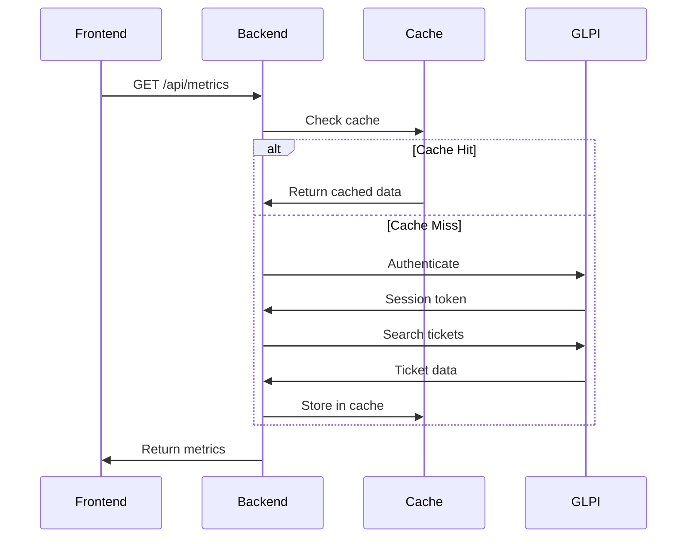

# Arquitetura do Sistema - GLPI Dashboard

## 🏗️ Visão Geral da Arquitetura

O GLPI Dashboard segue os princípios de **Clean Architecture** com separação clara de responsabilidades entre camadas.

```
┌─────────────────────────────────────────────────────────────┐
│                    FRONTEND (React/TS)                     │
├─────────────────────────────────────────────────────────────┤
│  Components │  Hooks  │  Services │  Store  │  Utils       │
└─────────────────────────────────────────────────────────────┘
                              │
                         HTTP/REST API
                              │
┌─────────────────────────────────────────────────────────────┐
│                     BACKEND (Flask)                        │
├─────────────────────────────────────────────────────────────┤
│                    API Layer (routes.py)                   │
├─────────────────────────────────────────────────────────────┤
│                 Application Layer (services)               │
├─────────────────────────────────────────────────────────────┤
│                 Domain Layer (business logic)              │
├─────────────────────────────────────────────────────────────┤
│              Infrastructure Layer (external APIs)          │
└─────────────────────────────────────────────────────────────┘
                              │
                         HTTP/REST API
                              │
┌─────────────────────────────────────────────────────────────┐
│                      GLPI System                           │
└─────────────────────────────────────────────────────────────┘
```

## 🎯 Componentes Principais

### Frontend (React + TypeScript)

**Localização**: `frontend/src/`

- **Components**: Componentes React reutilizáveis
- **Hooks**: Hooks customizados para lógica de estado
- **Services**: Camada de comunicação com APIs
- **Store**: Gerenciamento de estado global
- **Utils**: Funções utilitárias e helpers

**Tecnologias**:
- React 18+ com TypeScript
- Vite para build e desenvolvimento
- Tailwind CSS para estilização
- React Query para cache de dados
- Zustand para gerenciamento de estado

### Backend (Flask)

**Localização**: `backend/`

#### API Layer
- **Arquivo**: `api/routes.py`
- **Responsabilidade**: Endpoints REST, validação de entrada, serialização
- **Padrões**: RESTful APIs, validação com schemas

#### Application Layer
- **Arquivo**: `services/glpi_service.py`
- **Responsabilidade**: Orquestração de casos de uso, transformação de dados
- **Padrões**: Service pattern, dependency injection

#### Domain Layer
- **Localização**: `core/domain/`
- **Responsabilidade**: Regras de negócio, entidades, value objects
- **Padrões**: Domain-driven design, rich domain models

#### Infrastructure Layer
- **Localização**: `infrastructure/`
- **Responsabilidade**: Acesso a dados externos, cache, logging
- **Padrões**: Repository pattern, adapter pattern

**Tecnologias**:
- Flask 2.3+ com extensões
- Redis para cache
- Prometheus para métricas
- Structured logging com JSON

### Sistema GLPI

**Interface**: REST API
**Autenticação**: Token-based (User Token + App Token)
**Endpoints principais**:
- `/initSession` - Autenticação
- `/search/Ticket` - Busca de tickets
- `/killSession` - Logout

## 🔄 Fluxo de Dados

### 1. Requisição de Métricas



### 2. Processamento de Dados

```python
# Fluxo típico no backend
def get_metrics(filters):
    # 1. Validação de entrada
    validated_filters = validate_filters(filters)
    
    # 2. Verificação de cache
    cache_key = generate_cache_key(validated_filters)
    cached_data = cache.get(cache_key)
    
    if cached_data:
        return cached_data
    
    # 3. Busca no GLPI
    glpi_data = glpi_service.search_tickets(validated_filters)
    
    # 4. Transformação de dados
    metrics = transform_to_metrics(glpi_data)
    
    # 5. Cache do resultado
    cache.set(cache_key, metrics, ttl=300)
    
    return metrics
```

## 🏛️ Padrões Arquiteturais

### Clean Architecture

- **Independência de frameworks**: Lógica de negócio isolada
- **Testabilidade**: Cada camada pode ser testada independentemente
- **Independência de UI**: Backend pode servir múltiplos frontends
- **Independência de banco**: Abstração de acesso a dados

### Repository Pattern

```python
class GLPIRepository:
    """Abstração para acesso aos dados do GLPI"""
    
    def find_tickets(self, criteria: SearchCriteria) -> List[Ticket]:
        pass
    
    def get_ticket_by_id(self, ticket_id: int) -> Optional[Ticket]:
        pass
```

### Service Layer

```python
class MetricsService:
    """Serviço para cálculo de métricas"""
    
    def __init__(self, glpi_repo: GLPIRepository, cache: Cache):
        self.glpi_repo = glpi_repo
        self.cache = cache
    
    def calculate_metrics(self, filters: MetricsFilters) -> Metrics:
        # Lógica de negócio para cálculo de métricas
        pass
```

## 🔧 Configuração e Ambiente

### Variáveis de Ambiente

```bash
# Backend
FLASK_ENV=development
GLPI_URL=http://glpi.example.com/apirest.php
GLPI_USER_TOKEN=your_user_token
GLPI_APP_TOKEN=your_app_token
REDIS_URL=redis://localhost:6379

# Frontend
VITE_API_BASE_URL=http://localhost:5000/api
VITE_API_TIMEOUT=10000
```

### Configuração de Desenvolvimento

```python
# backend/config/settings.py
class DevelopmentConfig:
    DEBUG = True
    CACHE_TYPE = 'redis'
    CACHE_REDIS_URL = 'redis://localhost:6379'
    LOG_LEVEL = 'DEBUG'
```

## 📊 Observabilidade

### Logging Estruturado

```python
logger.info(
    "Metrics calculated",
    extra={
        "correlation_id": correlation_id,
        "filters": filters,
        "execution_time_ms": execution_time,
        "cache_hit": cache_hit
    }
)
```

### Métricas Prometheus

- `http_requests_total` - Total de requisições HTTP
- `http_request_duration_seconds` - Duração das requisições
- `glpi_api_calls_total` - Chamadas para API do GLPI
- `cache_operations_total` - Operações de cache

### Health Checks

- `/health` - Status geral da aplicação
- `/health/glpi` - Conectividade com GLPI
- `/health/cache` - Status do cache Redis

## 🔒 Segurança

### Autenticação

- Tokens GLPI armazenados como variáveis de ambiente
- Sessões GLPI com timeout automático
- Validação de entrada em todos os endpoints

### CORS

```python
CORS(app, origins=[
    "http://localhost:3001",  # Frontend dev
    "https://dashboard.example.com"  # Frontend prod
])
```

### Rate Limiting

- Limite de requisições por IP
- Cache para reduzir carga no GLPI
- Circuit breaker para falhas de API

---

**AI Context Tags**: `architecture`, `clean-architecture`, `flask`, `react`, `glpi-integration`
**Related Files**: `backend/api/routes.py`, `backend/services/glpi_service.py`, `frontend/src/services/api.ts`
**Last Updated**: 2024-01-15