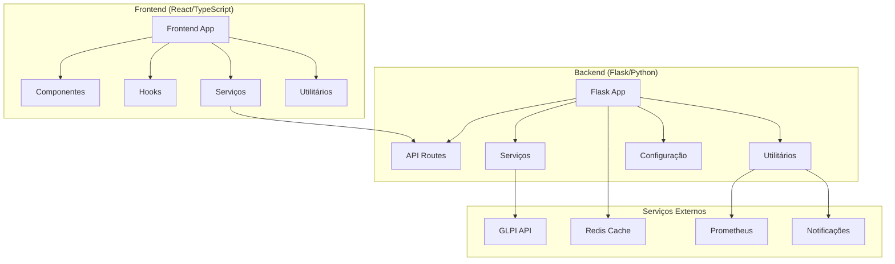
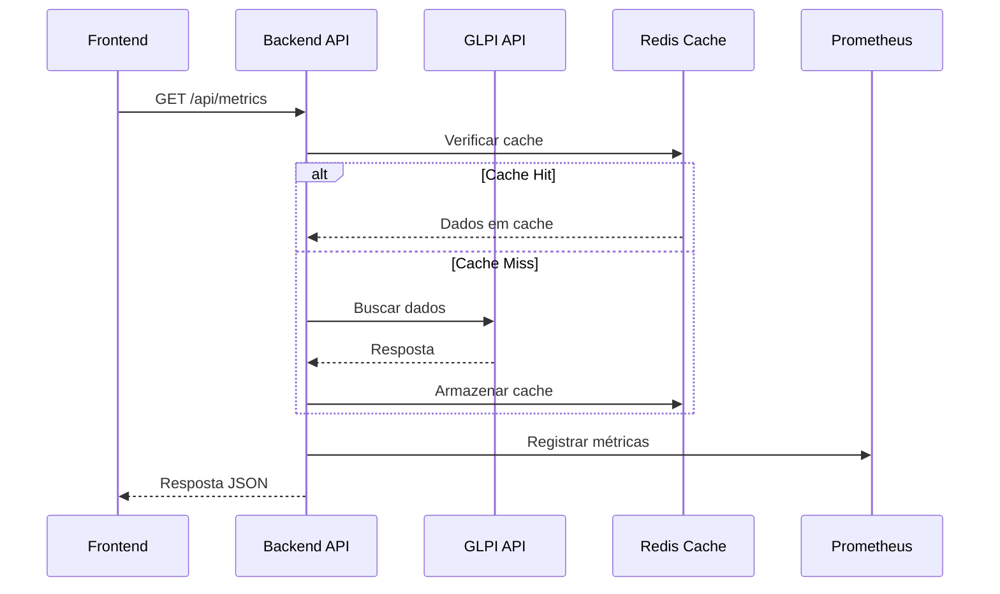

# Mapa de Dependências - GLPI Dashboard

## Visão Geral

Este documento apresenta uma análise completa das dependências do projeto GLPI Dashboard, incluindo dependências internas, externas, fluxos de dados e pontos de integração.

## Arquitetura do Sistema



## Dependências do Backend

### Dependências Principais

| Categoria | Biblioteca | Versão | Uso |
|-----------|------------|--------|---------|
| **Framework** | Flask | 2.3.3 | Framework web principal |
| **HTTP Client** | requests | 2.31.0 | Comunicação com GLPI API |
| **Cache** | redis | 4.6.0 | Sistema de cache |
| **Cache Framework** | Flask-Caching | 2.1.0 | Integração de cache com Flask |
| **CORS** | Flask-CORS | 4.0.0 | Controle de CORS |
| **Observabilidade** | prometheus-client | 0.17.1 | Métricas Prometheus |
| **Logging** | structlog | 23.1.0 | Logging estruturado |
| **Validação** | marshmallow | 3.20.1 | Validação de dados |
| **Configuração** | python-dotenv | 1.0.0 | Gerenciamento de variáveis de ambiente |
| **Database** | Flask-SQLAlchemy | 3.0.5 | ORM (preparação futura) |
| **Database Driver** | PyMySQL | 1.1.0 | Driver MySQL |

### Estrutura de Módulos Internos

```
backend/
├── api/
│   ├── routes.py          # Endpoints da API
│   ├── controllers/       # Controladores
│   └── schemas/          # Esquemas de validação
├── services/
│   └── glpi_service.py   # Serviço principal GLPI
├── utils/
│   ├── prometheus_metrics.py    # Métricas Prometheus
│   ├── structured_logging.py    # Logging estruturado
│   ├── alerting_system.py       # Sistema de alertas
│   └── observability_middleware.py # Middleware observabilidade
├── config/
│   └── settings.py       # Configurações centralizadas
└── core/
    ├── infrastructure/   # Infraestrutura
    ├── application/     # Camada de aplicação
    └── domain/         # Domínio
```

### Dependências Circulares Identificadas

⚠️ **Potenciais Problemas:**
- Múltiplas importações de `GLPIService` (tanto `services.glpi_service` quanto `backend.services.glpi_service`)
- Imports cruzados entre utilitários de observabilidade

## Dependências do Frontend

### Dependências Principais

| Categoria | Biblioteca | Versão | Uso |
|-----------|------------|--------|---------|
| **Framework** | React | 18.2.0 | Framework principal |
| **Build Tool** | Vite | 5.0.0 | Ferramenta de build |
| **HTTP Client** | axios | 1.6.0 | Cliente HTTP |
| **State Management** | @tanstack/react-query | 5.85.3 | Gerenciamento de estado servidor |
| **UI Components** | @radix-ui/* | Várias | Componentes UI |
| **Charts** | chart.js + react-chartjs-2 | 4.4.0 + 5.2.0 | Gráficos |
| **Charts Alt** | recharts | 3.1.2 | Gráficos alternativos |
| **Icons** | @heroicons/react | 2.2.0 | Ícones |
| **Icons Alt** | lucide-react | 0.294.0 | Ícones alternativos |
| **Animation** | framer-motion | 12.23.12 | Animações |
| **Styling** | tailwindcss | 3.3.5 | Framework CSS |
| **Tables** | @tanstack/react-table | 8.21.3 | Tabelas avançadas |
| **Monitoring** | web-vitals | 5.1.0 | Métricas de performance |

### Estrutura de Componentes

```
frontend/src/
├── components/
│   ├── MetricCard.tsx
│   ├── MetricsGrid.tsx
│   ├── StatusCard.tsx
│   ├── RankingTable.tsx
│   └── ui/              # Componentes base
├── hooks/
│   ├── useApi.ts
│   ├── useDashboard.ts
│   ├── usePerformanceMonitoring.ts
│   └── useDebounce.ts
├── services/
│   ├── apiService.ts
│   └── httpClient.ts
├── utils/
│   ├── performanceMonitor.ts
│   ├── dataValidation.ts
│   └── dataCache.ts
└── types/
    └── api.ts           # Tipos TypeScript
```

## Endpoints da API

### Endpoints Principais

| Endpoint | Método | Descrição | Parâmetros |
|----------|--------|-----------|------------|
| `/api/metrics` | GET | Métricas gerais do dashboard | - |
| `/api/metrics/filtered` | GET | Métricas filtradas | `start_date`, `end_date`, `status`, `priority`, `level`, `technician`, `category` |
| `/api/technicians/ranking` | GET | Ranking de técnicos | `start_date`, `end_date`, `level`, `limit` |
| `/api/tickets/new` | GET | Novos tickets | `limit`, `priority`, `category`, `technician`, `start_date`, `end_date` |
| `/api/alerts` | GET | Alertas do sistema | - |
| `/api/performance/stats` | GET | Estatísticas de performance | - |
| `/api/status` | GET | Status geral do sistema | - |
| `/api/health` | GET | Health check da API | - |
| `/api/health/glpi` | GET | Health check do GLPI | - |
| `/api/filter-types` | GET | Tipos de filtro disponíveis | - |

### Fluxo de Dados



## Serviços Externos

### GLPI API

**Configuração:**
- URL: `GLPI_URL` (padrão: http://10.73.0.79/glpi/apirest.php)
- Autenticação: `GLPI_USER_TOKEN` + `GLPI_APP_TOKEN`
- Timeout: `API_TIMEOUT` (padrão: 30s)

**Endpoints Utilizados:**
- `/initSession` - Autenticação
- `/search/Ticket` - Busca de tickets
- `/search/User` - Busca de usuários
- `/search/Group` - Busca de grupos
- `/killSession` - Encerramento de sessão

### Redis Cache

**Configuração:**
- URL: `REDIS_URL` (padrão: redis://localhost:6379/0)
- Timeout: `CACHE_DEFAULT_TIMEOUT` (padrão: 300s)
- Prefix: `CACHE_KEY_PREFIX` (padrão: glpi_dashboard:)
- Fallback: SimpleCache em caso de falha

**Dados Cacheados:**
- Ranking de técnicos
- Técnicos ativos
- IDs de campos
- Métricas de dashboard

### Prometheus

**Configuração:**
- Gateway: `PROMETHEUS_GATEWAY_URL` (padrão: http://localhost:9091)
- Job: `PROMETHEUS_JOB_NAME` (padrão: glpi_dashboard)

**Métricas Coletadas:**
- `glpi_requests_total` - Total de requisições
- `glpi_request_duration_seconds` - Duração das requisições
- `glpi_errors_total` - Total de erros
- `cache_hits_total` - Cache hits
- `cache_misses_total` - Cache misses

### Sistema de Notificações

**Configuração (monitoring_config.json):**
```json
{
  "notifications": {
    "email_enabled": false,
    "email_recipients": [],
    "slack_enabled": false,
    "slack_webhook": ""
  }
}
```

**Handlers Disponíveis:**
- Console notifications
- Log notifications
- Email notifications (configurável)
- Slack notifications (configurável)

## Matriz de Dependências

### Backend → Serviços Externos

| Módulo | GLPI | Redis | Prometheus | Notificações |
|--------|------|-------|------------|-------------|
| `glpi_service.py` | ✅ | ✅ | ✅ | ❌ |
| `api/routes.py` | ✅ | ✅ | ✅ | ❌ |
| `utils/prometheus_metrics.py` | ❌ | ❌ | ✅ | ❌ |
| `utils/alerting_system.py` | ❌ | ❌ | ✅ | ✅ |
| `utils/structured_logging.py` | ❌ | ❌ | ✅ | ❌ |

### Frontend → Backend

| Componente | Endpoints Utilizados |
|------------|---------------------|
| `MetricsGrid` | `/api/metrics`, `/api/metrics/filtered` |
| `RankingTable` | `/api/technicians/ranking` |
| `StatusCard` | `/api/status`, `/api/health` |
| `AlertsPanel` | `/api/alerts` |
| `PerformanceStats` | `/api/performance/stats` |

## Pontos de Integração Críticos

### 1. Autenticação GLPI
- **Localização:** `backend/services/glpi_service.py:_perform_authentication()`
- **Dependências:** `GLPI_URL`, `GLPI_USER_TOKEN`, `GLPI_APP_TOKEN`
- **Retry Logic:** Backoff exponencial com 3 tentativas
- **Cache:** Session tokens com expiração

### 2. Sistema de Cache
- **Localização:** `backend/app.py:create_app()`
- **Fallback:** Redis → SimpleCache
- **Configuração:** Dinâmica baseada em disponibilidade

### 3. Observabilidade
- **Middleware:** `backend/utils/observability_middleware.py`
- **Métricas:** Prometheus com push gateway
- **Logging:** Estruturado com redação de dados sensíveis

### 4. Comunicação Frontend-Backend
- **Cliente HTTP:** Axios com interceptors
- **Error Handling:** Centralizado em `apiService.ts`
- **State Management:** React Query para cache e sincronização

## Recomendações

### Melhorias de Arquitetura

1. **Resolver Dependências Circulares**
   - Padronizar imports do GLPIService
   - Criar factory pattern para serviços

2. **Otimizar Cache**
   - Implementar cache distribuído
   - Adicionar invalidação inteligente

3. **Melhorar Observabilidade**
   - Adicionar tracing distribuído
   - Implementar health checks mais robustos

4. **Segurança**
   - Implementar rate limiting
   - Adicionar validação de entrada mais rigorosa
   - Configurar HTTPS em produção

### Monitoramento

1. **Alertas Críticos**
   - Falha de autenticação GLPI
   - Cache Redis indisponível
   - Tempo de resposta > 300ms
   - Taxa de erro > 5%

2. **Métricas de Negócio**
   - Tickets processados por hora
   - Ranking de técnicos atualizado
   - Disponibilidade do dashboard

---

**Última Atualização:** Janeiro 2025  
**Versão:** 1.0.0  
**Responsável:** Análise Automatizada de Dependências